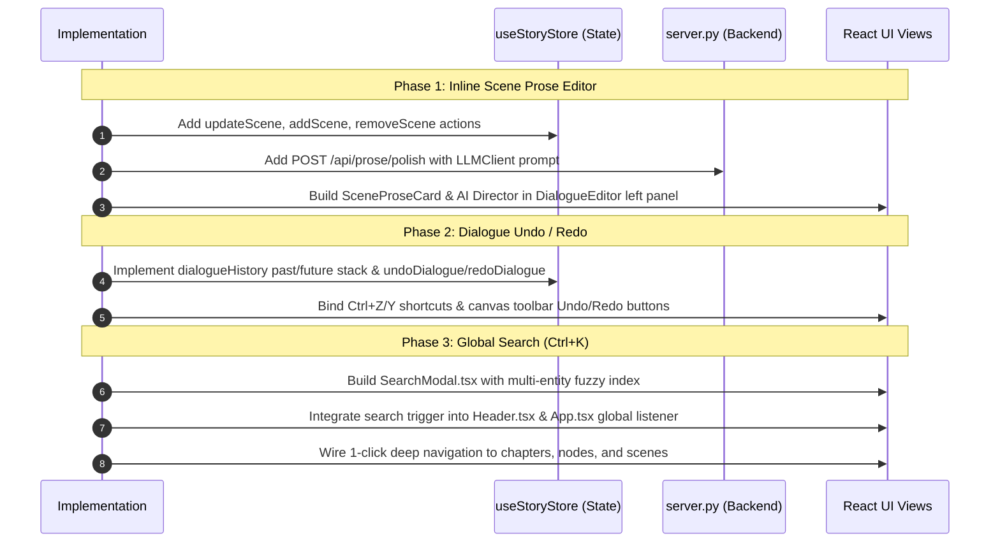

# Narrative Editing Evolution: Top 3 Enhancements Plan

## Executive Summary

While QuestForge excels at automated multi-stage pipeline generation (World Bible, Story Spine, Quests, Scene Prose, and Dialogue Trees), human narrative editing requires rapid iteration, safety rails, and fast navigation. Based on the narrative editing workflow review, this plan outlines the top 3 highest-impact features to elevate QuestForge into a writer-first narrative studio:

```mermaid
graph TD
    subgraph Feature 1 [1. Inline Scene Prose Editor & AI Polish]
        A1[Editable Scene Prose & Beats] --> A2[AI Polish Assistant: Tone / Sensory / Tension]
        A2 --> A3[Store updateScene & Backend POST /api/prose/polish]
    end

    subgraph Feature 2 [2. Dialogue Tree Undo / Redo History]
        B1[Snapshot History Stack per Chapter] --> B2[Undo / Redo Actions in useStoryStore]
        B2 --> B3[Ctrl+Z / Ctrl+Y Hotkeys & Toolbar Buttons]
    end

    subgraph Feature 3 [3. Global Narrative Search & Command Palette]
        C1[Ctrl+K Command Palette Modal] --> C2[Full-Text Indexing: Prose, Nodes, Quests, Bios]
        C2 --> C3[1-Click Deep Navigation to Chapter / Node / Scene]
    end
```



---

## Feature 1: Inline Scene Prose Editor with AI Director / Polish

### Context & Need
Currently, the left panel of the **Dialogue & Prose** view displays scene prose as truncated, read-only cards (`line-clamp-4`). Authors cannot edit descriptions, tweak emotional beats, or adjust prose to match player dialogue without re-running the entire narrator pipeline.

### Architectural Blueprint

#### 1. Store Enhancements ([useStoryStore.ts](file:///k:/AI/QuestBasedStory/designer/src/store/useStoryStore.ts))
Add granular scene editing actions that immutably update the chapter's scenes array:
```typescript
updateScene: (chapterId: string, sceneId: string, patch: Partial<Scene>) => void;
addScene: (chapterId: string, scene?: Partial<Scene>) => void;
removeScene: (chapterId: string, sceneId: string) => void;
```
If a project is currently loaded, queue an asynchronous persist to `project_manager.save_project_state`.

#### 2. Backend Endpoint ([pipeline/api/server.py](file:///k:/AI/QuestBasedStory/pipeline/api/server.py))
Add `POST /api/prose/polish` supporting targeted narrative rewrites:
- **Request Payload**:
  ```python
  class ProsePolishRequest(BaseModel):
      project_id: str | None = None
      chapter_id: str
      scene_title: str
      current_prose: str
      emotional_beat: str | None = None
      characters_present: list[str] = []
      instruction: str  # e.g. "punch_up", "more_sensory", "heighten_tension", "condense", "custom"
      custom_prompt: str | None = None
      model: str = "default"
  ```
- **Execution**: Invokes `LLMClient.generate()` with context-aware system instructions enforcing active voice, sensory details, and continuity with character voices.
- **Response**: `{ "polished_prose": "...", "emotional_beat": "..." }`

#### 3. Frontend UI ([DialogueEditor.tsx](file:///k:/AI/QuestBasedStory/designer/src/views/DialogueEditor.tsx))
Replace read-only cards in the left sidebar with an expandable, interactive scene editor:
- **Collapsed State**: Scene title, emotional beat badge, prose snippet, word count, edit icon.
- **Expanded / Edit State**:
  - Editable scene title input.
  - Emotional beat selector / text input (e.g., `Dread & Suspicion`, `Triumphant Revel`).
  - Auto-resizing prose textarea with markdown support.
  - **AI Director Toolbar**:
    - Quick Action chips: `✨ Punch Up`, `👁️ More Sensory`, `⚡ Heighten Tension`, `✂️ Condense`.
    - Custom prompt field for bespoke revisions.
    - Diff preview toggle (accept changes vs. revert).

---

## Feature 2: Dialogue Tree Undo / Redo & Version History

### Context & Need
Graph editing is high-risk. Accidental deletions, drag-handle misclicks, choice disconnections, or bulk auto-layouts cannot be undone. Writers need standard editing safety nets (`Ctrl+Z` / `Ctrl+Y`).

### Architectural Blueprint

#### 1. History Data Structure ([useStoryStore.ts](file:///k:/AI/QuestBasedStory/designer/src/store/useStoryStore.ts))
Maintain per-chapter snapshot history stacks:
```typescript
interface DialogueHistoryState {
  past: DialogueNode[][];
  future: DialogueNode[][];
}

// In StoryStoreState:
dialogueHistory: Record<string, DialogueHistoryState>;
canUndoDialogue: (chapterId: string) => boolean;
canRedoDialogue: (chapterId: string) => boolean;
undoDialogue: (chapterId: string) => void;
redoDialogue: (chapterId: string) => void;
```

#### 2. Mutation Interception
Before any destructive change:
1. Push a deep clone of the current chapter's `dialogue_tree` onto `dialogueHistory[chapterId].past` (capped at max 30 snapshots to conserve memory).
2. Clear `dialogueHistory[chapterId].future`.
3. Apply the mutation (`addDialogueNode`, `updateDialogueNode`, `removeDialogueNode`, `connectAsChoice`).

#### 3. Keyboard & Toolbar Integration ([DialogueEditor.tsx](file:///k:/AI/QuestBasedStory/designer/src/views/DialogueEditor.tsx))
- **Toolbar Buttons**: Add `Undo` (`Undo2` icon) and `Redo` (`Redo2` icon) buttons to the top-right canvas control bar with disabled state when stack is empty.
- **Keyboard Listener**: Attach a window-level keyboard listener (active when focus is inside canvas and not typing in an input/textarea):
  - `Ctrl+Z` / `Meta+Z`: Trigger `undoDialogue(activeChapterId)`
  - `Ctrl+Y` / `Ctrl+Shift+Z` / `Meta+Shift+Z`: Trigger `redoDialogue(activeChapterId)`
- **Canvas State Resync**: When an undo/redo occurs, React Flow automatically updates node positions, labels, choice connections, and inspector view.

#### 4. Unified Connection Drawing Model ([DialogueEditor.tsx](file:///k:/AI/QuestBasedStory/designer/src/views/DialogueEditor.tsx))
- **Choice-First Architecture**: Every user-drawn wire (whether dragged from React Flow handle sockets or dropped via the `+` drag handle onto an existing node) automatically attaches a `DialogueChoice` to the source node pointing to the target node (`next_node: targetId`).
- **Duplicate Prevention**: Ignores repeat connection attempts to the same target node.
- **Post-Edit in Expanded View**: The created choice is immediately editable inside the right-hand Inspector Drawer, allowing the author to rewrite the player's dialogue option text, assign trait bonuses (e.g., `+CUNNING`), and set conditional flags.

---

## Feature 3: Global Story Search & Command Palette (`Ctrl+K`)

### Context & Need
As stories expand to 5-10 chapters with multiple quests, dozens of scenes, and 100+ dialogue branches, locating where a specific character speaks, where a quest flag is set, or where a clue is revealed requires tedious manual hunting across views.

### Architectural Blueprint

#### 1. Unified Search Index (Client-Side)
Search runs instantaneously in-memory over the loaded project state in `useStoryStore`:
| Entity Type | Fields Indexed | Target Action on Click |
|---|---|---|
| **Dialogue Node** | `speaker`, `text`, choice `label`, `flags_set` | Switch to Dialogue view, set active chapter, pan to & highlight node |
| **Scene Prose** | `title`, `prose`, `emotional_beat`, `characters_present` | Switch to Dialogue view, set active chapter, open & focus scene editor |
| **Quest / Objective** | `title`, `description`, `objective`, `unlock_flag` | Switch to Quests view, highlight quest card |
| **Character / NPC** | `name`, `archetype`, `summary`, `voice_tone`, `traits` | Switch to Cast & World view, focus character profile |
| **Location / Faction** | `name`, `description`, `significance` | Switch to Cast & World view, open location card |

#### 2. Component Design ([designer/src/components/SearchModal.tsx](file:///k:/AI/QuestBasedStory/designer/src/components/SearchModal.tsx))
- **Trigger**:
  - Global hotkey: `Ctrl+K` or `Cmd+K`.
  - Header search icon / search button with keyboard shortcut badge (`⌘K`).
- **Modal Layout**:
  - Top search input with instant debounced filtering.
  - Category filter pills: `All`, `Dialogue`, `Prose`, `Quests`, `Characters`, `World`.
  - Result list with highlighted match snippets, icon badges, and breadcrumb tags (e.g., `Chapter 1 > Scene 2`).
  - Keyboard navigation: `↑` / `↓` to select, `Enter` to jump, `Esc` to close.

#### 3. Deep-Link Navigation Hooks
- When a user selects a dialogue node result from Chapter 3:
  1. `setActiveView('dialogue')`
  2. `setSelectedChapterId(targetChapterId)`
  3. Emit an event / store trigger to highlight and center the node in React Flow canvas.

---

## Implementation Sequence & Dependencies



---

## Verification & Testing Plan
1. **Feature 1 Test**: Edit scene prose in Chapter 1, verify instant state updates, trigger AI polish with "Punch Up", verify stream/response updates the scene text and persists across view switches.
2. **Feature 2 Test**: Add 3 dialogue nodes, delete one, modify text on another. Hit `Ctrl+Z` twice, verify exact state restoration. Hit `Ctrl+Y`, verify redone edits.
3. **Feature 3 Test**: Press `Ctrl+K`, search for a specific character name or phrase. Click a dialogue result in Chapter 2, confirm view switches to Chapter 2 and highlights the exact node.
4. **Build Verification**: Run `cmd /c "cd /d k:\AI\QuestBasedStory\designer && npm run build 2>&1"` to ensure zero TypeScript or bundling errors.
